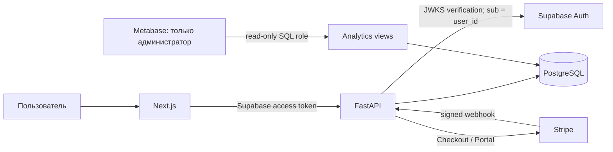

# План запуска Auth, Billing и внутренней аналитики

Дата: 2026-09-12  
Статус: план, без реализации и без deployment  
Фаза 2 creative research: не входит в этот документ

## 1. Решение

Не заменять существующий backend готовым SaaS starter-kit. В проекте уже реализованы основные безопасные границы:

- Supabase JWT проверяется FastAPI по JWKS, issuer, audience, expiration и `sub`;
- `sub` становится внутренним `user_id`;
- assets, prompts, chats, quotes, generations, credits и billing выбираются по `user_id`;
- для одного внутреннего пользователя создаётся один Stripe Customer;
- Checkout связывается с этим Customer и `user_id`;
- кредиты выдаются только после подписанного Stripe webhook, с дедупликацией событий и повторной проверкой оплаченного Price;
- операции кредитов записываются в append-only ledger.

Нужна не новая backend-платформа, а включение уже написанных Supabase/Stripe-контуров, полная проверка изоляции и готовая внутренняя BI-панель.

Целевая сборка:

Главный запускной gate: **реальная авторизация должна быть включена раньше Stripe**. При `AUTH_MODE=mock` все браузеры получают один `development-user`; подключать реальные платежи в таком режиме нельзя.

## 2. Что уже есть в коде

| Задача | Фактическая реализация | Вывод |
|---|---|---|
| Проверка identity | `apps/api/app/auth.py:12-35`: Bearer JWT, Supabase issuer/JWKS, ES256/RS256, обязательные `exp/sub/iss/aud` | Не писать собственную auth-систему |
| Создание пользователя и credit account | `auth.py:36-42`: conflict-safe insert | Уже готово для параллельного первого входа |
| Изоляция генераций | `services/generations.py:105-112, 239-251` | Чтение одной генерации и history фильтруются по `user_id` |
| Изоляция media | `services/assets.py:13-22` | Чужой asset не принимается в генерацию |
| Изоляция chat | `services/chat.py:35-40` | Chat session выбирается по `id + user_id` |
| Stripe Customer | `services/billing.py:33-47` | Один Customer на internal user, idempotency key привязан к `user_id` |
| Checkout | `services/billing.py:48-63` | Customer, `client_reference_id` и metadata привязаны к internal user |
| Webhook | `services/billing.py:76-126` | Signature, event dedup, customer mapping, server catalog, line-item verification |
| Подписки | `services/billing.py:127-158` | `invoice.paid` выдаёт кредиты; subscription events обновляют статус |
| Защита production-конфига | `apps/api/app/config.py:63-82` | Production не стартует с mock auth/local storage/mock providers |
| Проверка двух пользователей | `tests/test_generations.py:57-65` | Bob не может прочитать generation Alice; набор тестов надо расширить на все ресурсы |

Текущая схема не хранит полноценный денежный факт. `subscriptions` хранит Customer/Subscription/plan/status, `webhook_events` — только ID и hash, credit ledger — кредиты. Поэтому точные поля «сколько заплатил, в какой валюте и когда» сейчас надёжно видны в Stripe Dashboard, но не могут честно появиться в едином SQL dashboard без отдельной payment projection.

## 3. Матрица готовых решений

| Вариант | Что реально готово | Совместимость | Цена/ограничение | Решение |
|---|---|---|---|---|
| **Текущий FastAPI + Supabase + Stripe + Metabase OSS** | Auth, billing endpoints и ledger уже в проекте; Metabase даёт готовые dashboards поверх PostgreSQL | Максимальная; UI продукта остаётся текущим | Metabase OSS self-hosted бесплатен; нужен отдельный контейнер, read-only DB role и закрытый admin-доступ | **Выбран** |
| **Stripe Dashboard + Supabase Dashboard** | Stripe: payments, refunds, subscriptions, financial reports; Supabase: users и auth audit logs | Подключается без разработки | Нет единого экрана и продуктовых метрик генераций | Использовать сразу как launch console |
| **Makerkit Next.js + Supabase Turbo** | Next.js, Supabase, Stripe, shadcn/Tailwind, billing, portal, multi-tenancy, Super Admin, управление users/subscriptions | Технологически близок | Это коммерческий starter (на сайте от $349), а не подключаемый backend. Потребует перенести или задублировать текущие auth, DB и billing | Не внедрять; использовать как референс admin UX/security |
| **Clerk Billing** | Auth, organizations и billing UI | Потребует заменить Supabase identity и текущий Stripe mapping | Отдельная модель планов; существующие Stripe products/plans не синхронизируются; 0.7% Clerk fee сверх Stripe по текущей документации | Отклонить |
| **Случайный shadcn admin template** | Обычно только React UI | Backend, ownership, webhooks и ledger отсутствуют | Красивый экран создаёт ложное чувство готовности | Не использовать как billing backend |

Готового drop-in продукта «shadcn admin + FastAPI endpoints + наша credit/generation schema» не найдено. Makerkit ближе всего визуально и функционально, но заменяет основу приложения. Для текущего проекта это дороже и опаснее, чем закончить уже существующий контур.

## 4. Целевая ответственность компонентов

| Компонент | Единственная ответственность |
|---|---|
| Supabase Auth | Регистрация, login, OAuth/email sessions, verified JWT subject |
| Next.js | Cookie/session UX, передача access token; не передаёт `user_id` как доверенное поле |
| FastAPI | JWT verification, ownership, quotes, generations, credits, Checkout/Portal endpoints |
| PostgreSQL | Users, resources, subscriptions, credit ledger, payment projection, analytics views |
| Stripe | Customers, Checkout, subscriptions, invoices, payments, refunds, Customer Portal |
| Metabase | Внутренние read-only отчёты; не меняет продуктовые данные |

Supabase RLS само по себе не защищает запросы SQLAlchemy, если FastAPI ходит в PostgreSQL под общим server role. На текущем стеке изоляцию обеспечивают verified JWT и обязательный `user_id` во всех backend-запросах. Это нужно доказать системной двухпользовательской матрицей. Переход на DB-level tenant context/RLS — отдельное архитектурное решение, не условие первого запуска.

## 5. План реализации

### Шаг 0. Production preflight

1. Зафиксировать VPS как источник истины и сравнить код с рабочими контейнерами.
2. Проверить реальный runtime config без вывода секретов: environment, auth mode, storage mode, frontend origin, наличие Supabase/Stripe configuration.
3. Не менять production, пока deploy source и rollback не проверены.
4. Снять резервную копию PostgreSQL перед первой миграцией.

Результат: таблица `configured / missing / invalid`, без публикации значений ключей.

### Шаг 1. Включить реальную Supabase Auth

1. Создать/подключить production Supabase project и разрешённые redirect URL для домена приложения.
2. Настроить Next.js SSR cookies через `@supabase/ssr`.
3. В server proxy использовать проверяющий серверный метод (`getClaims()` согласно актуальной Supabase SSR документации; текущий `getUser()` безопасно валидирует через Auth server, но план должен унифицировать один проверенный паттерн).
4. FastAPI оставляет текущую JWKS-проверку и никогда не принимает browser `user_id`.
5. Убрать runtime mock-auth и проверить, что production guard не позволяет его вернуть.
6. Проверить logout, expiry, refresh, revoked/invalid token, неправильные issuer/audience.

Acceptance:

- два реальных тестовых пользователя получают разные `sub`;
- для каждого создаётся отдельная строка `users` и `credit_accounts`;
- запрос без JWT получает 401;
- JWT другого Supabase project/audience отклоняется;
- после logout защищённые страницы и API недоступны.

### Шаг 2. Закрыть ownership по всем объектам

Добавить параметризованные интеграционные тесты Alice/Bob для:

| Ресурс/операция | Ожидаемое поведение Bob для объекта Alice |
|---|---|
| asset metadata/download/use as input | 404 |
| prompt/recipe | 404 |
| chat read/update/change concept | 404 |
| quote accept/use | 404 или stale/invalid без утечки существования |
| generation read/cancel/history/output/download | 404; не появляется в history |
| credit summary/ledger | видит только свой balance |
| billing summary/portal | видит только своего Stripe Customer |
| Checkout | создаётся Customer Bob, не переиспользуется Customer Alice |
| storage object key/signed URL | user prefix и срок действия; чужой объект не подписывается |

Дополнительно:

- проверить каждую route function на получение identity только из `Depends(identity)`;
- унифицировать ответ на чужой ID как 404, чтобы не раскрывать существование объекта;
- запретить admin/service credentials в browser bundle;
- проверить concurrency первого login и первого Checkout.

### Шаг 3. Подключить Stripe сначала в test mode

1. Создать Products/Prices в Stripe test mode.
2. Сформировать server-side catalog: публичный plan ID → Stripe Price ID → credits → mode.
3. Настроить webhook endpoint на существующий `/api/webhooks/stripe`.
4. Подписать только реально обрабатываемые события и зафиксировать список в runbook.
5. Настроить Customer Portal.
6. Выполнить двухпользовательский end-to-end тест:
   - Alice и Bob получают разные Stripe Customer IDs;
   - payment Alice меняет только ledger Alice;
   - повторный webhook не выдаёт кредиты второй раз;
   - неверная подпись, чужая metadata и иной Price отклоняются;
   - subscription renewal выдаёт ровно один grant;
   - Portal Alice открывается только для Customer Alice.

Запрещённый порядок: live Stripe keys при mock auth.

### Шаг 4. Добавить денежную payment projection

Для единого admin dashboard нужна отдельная таблица, обновляемая только после verified webhook:

`billing_payments`

- `id` — внутренний ID;
- `user_id` — FK на пользователя;
- `stripe_customer_id`;
- `stripe_checkout_session_id` nullable unique;
- `stripe_invoice_id` nullable unique;
- `stripe_payment_intent_id` nullable unique;
- `catalog_id`, `stripe_price_id`;
- `kind` (`one_time` / `subscription`);
- `amount_total_minor`, `currency`;
- `status`;
- `paid_at`, `refunded_at` nullable;
- `credits_granted`;
- `created_at`, `updated_at`.

Правила:

- source of truth для денег остаётся Stripe;
- значения берутся из подписанного события и, где необходимо, перечитываются через Stripe API;
- upsert идемпотентен по Stripe object ID;
- grant credits и payment projection фиксируются в одной DB transaction после проверки;
- raw webhook payload и карточные данные не сохраняются;
- refund/dispute не должен автоматически отнимать уже потраченные кредиты без отдельной продуктовой политики. До её принятия он меняет payment status и создаёт operational alert.

### Шаг 5. Готовая админ-аналитика

#### 5.1 Сразу при запуске

- **Stripe Dashboard**: платежи, сумма/валюта/дата, refunds, subscriptions, invoices, payouts, финансовые отчёты.
- **Supabase Dashboard**: users и auth audit events.

Это уже готовые панели и они точнее самописного экрана на старте.

#### 5.2 Единый продуктовый dashboard

Развернуть Metabase OSS отдельным Docker service:

- отдельная application database/volume для состояния Metabase;
- отдельный PostgreSQL user с `CONNECT + SELECT` только на `analytics` schema/views;
- без `INSERT/UPDATE/DELETE` и без доступа к storage secrets;
- private admin hostname за SSO/access proxy, без public embedding;
- база приложения не публикуется наружу;
- dashboard доступен только владельцу/администратору.

Создать SQL views, а не давать dashboard прямой доступ ко всем operational JSON:

- `analytics.users_daily` — регистрации и активность;
- `analytics.user_summary` — user, plan/status, credits, число генераций, last activity;
- `analytics.generations_daily` — queued/completed/failed, success rate, duration, charged credits;
- `analytics.generation_failures` — provider/model/error code без prompt/private media;
- `analytics.revenue_daily` — paid/refunded amount по валютам;
- `analytics.credit_flow_daily` — purchased/reserved/charged/refunded credits;
- `analytics.subscription_summary` — active/past_due/cancelled, renewal.

Первый dashboard:

1. total users / new users 7d / active users 7d;
2. total generations / completed / failed / success rate;
3. generations и charged credits по пользователю;
4. revenue по дням и валютам;
5. платежи: кто, plan, сколько, когда, status;
6. active subscriptions и upcoming renewals;
7. refunds/disputes;
8. users с repeated failures или зависшими reservations.

Не называть internal credits «себестоимостью». Для прибыли нужны отдельные фактические provider cost records; сейчас `creditsCharged` — продуктовая единица, а не банковская сумма расходов.

### Шаг 6. Live rollout

1. Пройти test-mode acceptance и сохранить IDs тестовых объектов/событий, без секретов.
2. Проверить backup/restore и rollback.
3. Переключить Stripe catalog на live Price IDs и настроить отдельный live webhook secret.
4. Сделать минимальную реальную покупку владельцем.
5. Сверить один payment в трёх местах: Stripe Dashboard → `billing_payments` → credit ledger.
6. Проверить второй аккаунт и отсутствие взаимного доступа.
7. Включить alerts на webhook failures, repeated failed generations, stuck reservations и payment-to-ledger mismatch.

## 6. Что не делать

- не переносить проект на Makerkit только ради admin UI;
- не внедрять Clerk поверх Supabase;
- не писать собственную обработку банковских карт;
- не доверять `user_id`, Price ID, credits или payment success из браузера;
- не начислять кредиты по redirect `checkout=success`;
- не подключать Metabase с DB owner/write credentials;
- не выставлять Metabase публично и не использовать public embed;
- не показывать выручку, provider cost или прибыль из приблизительных данных;
- не включать Stripe live до реального двухпользовательского auth/ownership теста.

## 7. Измеримый Definition of Done

- production работает с реальной Supabase identity, не mock identity;
- Alice ни одним публичным endpoint не читает и не меняет данные Bob;
- у Alice и Bob разные Stripe Customer IDs;
- test и live Stripe webhook signature проверяются разными secrets;
- повторное событие не создаёт второй payment и не выдаёт второй grant;
- Billing page создаёт hosted Checkout и hosted Portal;
- точный платёж виден в Stripe и локальной payment projection;
- credit ledger совпадает с результатом оплаченного catalog item;
- Metabase подключён read-only и показывает users/generations/payments без prompt/media content;
- проверены backup, rollback, health и webhook alerting;
- ни один secret не находится в frontend bundle, документации, логах или agent bus.

## 8. Источники

- Supabase Auth и JWT/RLS: [Supabase Auth](https://supabase.com/docs/guides/auth), [JWT claims and JWKS](https://supabase.com/docs/guides/auth/jwts), [Server-side auth for Next.js](https://supabase.com/docs/guides/auth/server-side), [Server-side client validation](https://supabase.com/docs/guides/auth/server-side/creating-a-client?framework=nextjs&package-manager=npm&queryGroups=framework&queryGroups=package-manager), [User management](https://supabase.com/docs/guides/auth/managing-user-data), [Auth audit logs](https://supabase.com/docs/guides/auth/audit-logs).
- Stripe: [Dashboard](https://docs.stripe.com/dashboard/basics), [Reporting](https://docs.stripe.com/stripe-reports), [Reports API](https://docs.stripe.com/reports/api), [Checkout customers](https://docs.stripe.com/payments/checkout/guest-customers).
- Metabase: [Open Source Docker deployment](https://www.metabase.com/docs/latest/installation-and-operation/running-metabase-on-docker), [Dedicated read-only database user](https://www.metabase.com/docs/latest/databases/users-roles-privileges), [Embedding security](https://www.metabase.com/docs/latest/embedding/securing-embeds).
- Makerkit: [Next.js + Supabase + Stripe + shadcn kit](https://makerkit.dev/next-supabase), [Billing overview](https://makerkit.dev/docs/next-supabase-turbo/billing/overview), [Billing with Stripe](https://makerkit.dev/docs/next-supabase-turbo/billing/stripe), [Database architecture](https://makerkit.dev/docs/next-supabase-turbo/development/database-architecture), [Super Admin example](https://makerkit.dev/docs/react-router-supabase-turbo/admin).
- Clerk comparison: [Clerk Billing for B2B](https://clerk.com/docs/nextjs/guides/billing/for-b2b), [Organizations](https://clerk.com/docs/guides/organizations/getting-started).

## 9. Итог для реализации

Порядок задач: **real Supabase Auth → полный ownership test matrix → Stripe test mode → payment projection → Metabase read-only dashboard → live Stripe**. Внешний starter-kit не нужен. Makerkit полезен как проверенный образец shadcn/Supabase admin UX, Metabase — как готовая рабочая админ-аналитика, Stripe/Supabase Dashboards — как первичные операционные панели.
