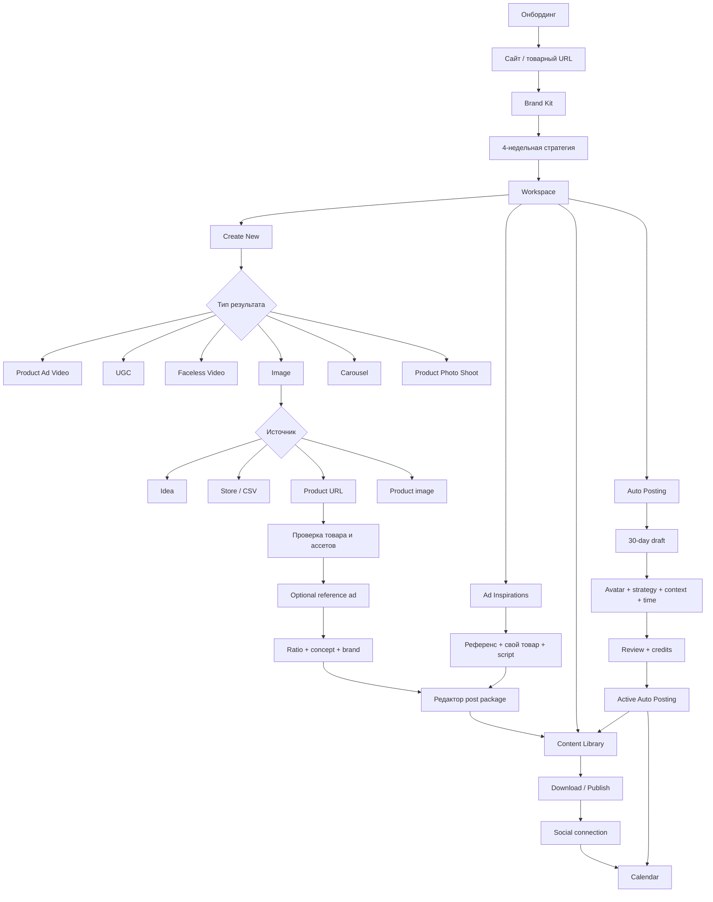
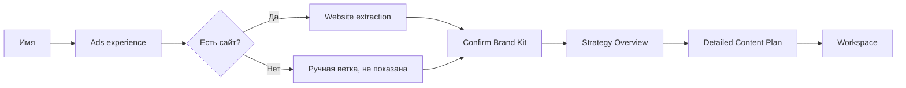
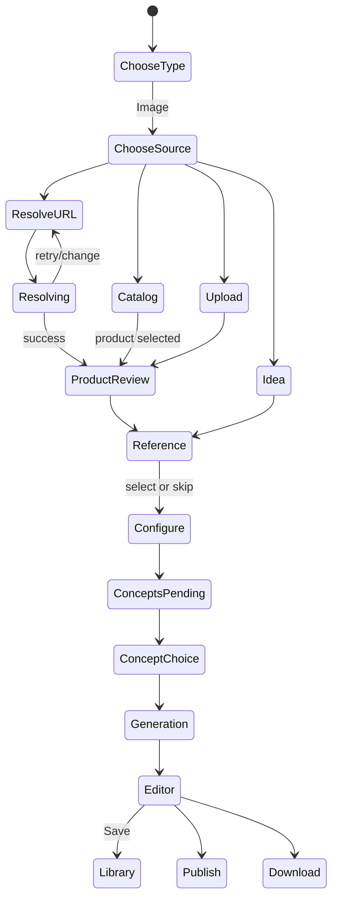
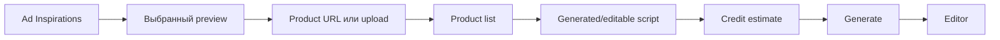
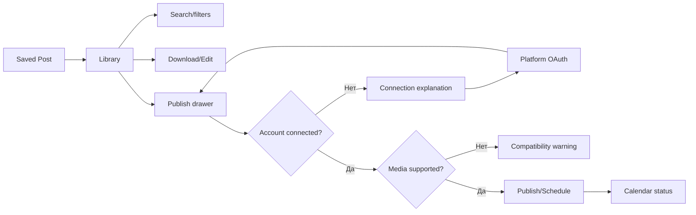
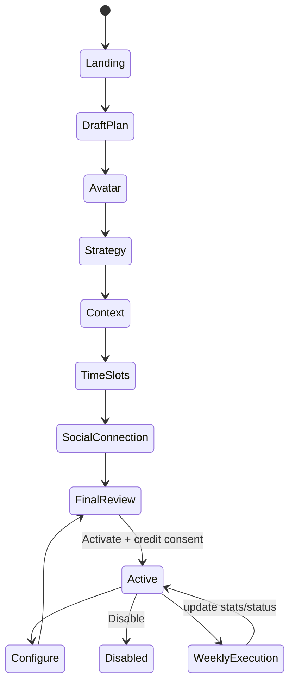

# Predis.ai: полный разбор потока от А до Я

**Дата фиксации:** 2026-09-15  
**Материал:** 33 доступных скриншота демо Predis.ai  
**Цель:** восстановить продуктовый поток, состояние данных, ветвления и роль каждого раздела  
**Статус:** конкурентный разбор; это не спецификация текущей фазы UGC

## Уровни достоверности

- **Наблюдение** — элемент прямо виден на скриншоте.
- **Связь** — переход подтверждается последовательностью, URL, прогрессом или сохранёнными данными.
- **Вывод** — вероятная продуктовая логика; это не подтверждённое внутреннее устройство Predis.

Серый слой, Play, таймлайн, миниатюры перемотки, Windows taskbar и чёрная верхняя полоса принадлежат видеоплееру/ОС, а не Predis.

## Главный вывод

Predis — не форма «промпт → картинка». Это связанная контентная система из четырёх контуров:

1. настройка пользователя, бизнеса, бренда и стратегии;
2. ручное создание из идеи, товара или референса;
3. редактор, библиотека, социальные подключения и календарь;
4. отдельный недельный цикл Auto Posting внутри месячной стратегии.



## Журнал каждого скриншота

Кадры сгруппированы в логическую последовательность интерфейса. Для однозначной связи с исходным материалом сохранены только номера изображений.

### 1. Image #37 — имя

**Видно:** отдельный onboarding shell без sidebar; логотип, Help, профиль и progress bar. Карточка `Hey let's get started`, вопрос `What should we call you?`, input и disabled Next.

**Зачем:** создаётся минимальная персона пользователя. Required-поле валидируется до перехода.

### 2. Image #36 — опыт с рекламой

**Видно:** вопрос `How comfortable are you with running ads?` и четыре взаимоисключающих варианта:

- Experienced — I use Ads Manager;
- Occasional Booster — I use the Boost button;
- Pro / Agency — I Manage Multiple Brands;
- Total Beginner — Never run ads.

Выбран Occasional Booster. Кнопки Next в кадре нет.

**Зачем:** сегментация по зрелости. Вероятно влияет на рекомендации и глубину подсказок. Автопереход после выбора возможен, но кадр этого не доказывает.

### 3. Image #35 — сайт или product URL

**Видно:** `Please enter your website or product URL`, обещание извлечь brand voice, checkbox `I don't have a website`, Next. Введён `predis.ai`.

**Зачем:** URL становится общим источником бизнес-контекста. Это не тот же объект, что URL конкретного товара в мастере Image. Есть альтернативная ручная ветка без сайта, но она не показана.

### 4. Image #34 — Brand Kit

**Видно:** извлечённые logo, четыре цвета, Font Family `Inter`, Target Ethnicity `US American ethnicity`; logo и цвета можно удалить/заменить; цвет можно добавить. Есть подсказка, что всё редактируется позже.

**Зачем:** автоматический импорт заканчивается проверяемой формой. Сущность Brand включает визуальный стиль и аудиторию, а не только «voice» из заголовка.

### 5. Image #33 — Strategy Overview

**Видно:** 10 posts/week с Optimised; Instagram, LinkedIn, TikTok; goal `Scale ad production efficiency`; tone professional/innovative/actionable; mix image 3, carousel 3, video 4. Четыре недельные темы: Eliminate Creative Friction, AI Workflow Deep-Dive, Proven Growth Results, Scale Your ROI. CTA `Create my 4 week Content Strategy`.

**Зачем:** сначала пользователь утверждает короткий стратегический контракт: частоту, каналы, цель, тон, format mix и недельную арку.

### 6. Image #32 — подробный Content Plan

**Видно:** та же сводка; Week 1 раскрыта и Confirmed; таблица Day/Post Idea/Media с 10 строками Mon–Fri, по две публикации в день; типы image, UGC, Carousel, video. Остальные недели ниже. CTA Next.

**Зачем:** стратегия разворачивается в иерархию `strategy → week → planned post`. Confirmed принадлежит неделе, не всему месяцу.

### 7. Image #31 — выбор источника Image

**Видно:** основной workspace со sidebar. `Create Image` предлагает четыре пути: Write Your Idea; Link a store or upload CSV (Recommended); Enter Product URL; Upload a product image. У каждого свой переход, снизу Back.

**Зачем:** Predis разделяет два решения — сначала тип результата, потом источник контекста.

### 8. Image #30 — Store/CSV

**Видно:** Shopify, Wix, Squarespace, WooCommerce с Connect; три trust-блока; предупреждение, что одновременно связывается одна платформа; ниже Other E-Commerce Platforms, Download Sample и CSV dropzone.

**Зачем:** массовый каталог создаёт повторно используемый источник товаров. Выбор SKU после подключения и CSV mapping не показаны.

### 9. Image #29 — Upload product image

**Видно:** dropzone, PNG/JPG/JPEG/WEBP и открытый Windows file picker.

**Зачем:** быстрый вход без сайта и магазина. Следующий экран этой ветки не показан.

### 10. Image #28 — Product URL resolving

**Видно:** URL Boat Rockerz Plus 550, spinner у поля; ниже ранее обнаруженные страницы сайта с radio и View more. Continue отсутствует.

**Зачем:** resolve асинхронный и блокирует переход. Список страниц переиспользует данные, найденные при анализе сайта.

### 11. Image #27 — ожидание URL

**Видно:** тот же URL и spinner спустя время.

**Зачем:** это реальное pending-state. Predis сохраняет форму и показывает локальный loader, не заменяя страницу пустым экраном.

### 12. Image #26 — Confirm product details

**Видно:** обязательный редактируемый Product Description; optional Price и Offer Price; Special Instructions; обязательные Assets; scroll-grid найденных изображений; multi-select checkmarks; плюс для добавления; Back/Continue.

**Зачем:** imported data не отправляются вслепую. Пользователь проверяет смысл и визуальные источники до расходной генерации.

**Особенно важно:** в grid смешаны наушники и триммеры. Ручной asset selection нужен, потому что парсер может собрать нерелевантные картинки.

### 13. Image #25 — инструкции/ассеты

**Видно:** фокус в Special Instructions, выбранные ассеты сохранены; есть scroll страницы и отдельный scroll asset-grid.

**Зачем:** description, commerce-поля, instructions и assets формируют одно товарное задание, редактируемое до запуска.

### 14. Image #24 — optional reference ad

**Видно:** `Remix a Winning Ad (optional)`; три Recommended references, View More либо upload собственного PNG/JPG/JPEG/WEBP; Back и Continue.

**Зачем:** product truth и visual direction разделены. Референс можно выбрать или пропустить.

### 15. Image #23 — Configure Image

**Видно:** Aspect Ratio 1:1, 9:16, 4:5, 2:3 и dropdown; Ad Concept; loading `Creating concepts that convert 2.3x better...`; Brand Settings linked; Continue disabled.

**Зачем:** сначала готовятся creative concepts, затем должен быть выбор и генерация. Сами concept cards на кадре ещё не появились. `2.3x better` — маркетинговый текст, не измерение пользователя.

### 16. Image #22 — Create router

**Видно:** шесть типов результата:

| Тип | Обещанная задача | Результат |
|---|---|---|
| Product Ad Video | promotions, launches, sales | short video до 15 sec |
| UGC | testimonials, reviews, trust-building | creator video до 30 sec |
| Faceless Video | tutorials, explainers, how-tos | narrated video до 30 sec |
| Image | social posts, ads, banners | static image, ready to post |
| Carousel | tips, lists, storytelling | multi-page, swipeable post |
| Product Photo Shoot | catalogs, stores, listings | studio product shots, HD |

На Carousel раскрыт hover с дополнительным описанием.

**Зачем:** выбор основан на бизнес-результате, провайдер и модель скрыты.

### 17. Image #21 — UGC hover и network warning

**Видно:** UGC раскрывает `Talking-head videos from real creators` и `Built for testimonials and reviews`. Сверху `Your internet connection seems unstable`.

**Зачем:** progressive disclosure объясняет карточку без перегрузки router. Состояние сети показывается глобально до возможного сбоя генерации.

### 18. Image #20 — Inspiration → UGC ad

**Видно:** modal поверх Ad Inspirations. Слева 9:16 preview выбранного ролика; справа Product URL/Upload image, Products + Add, empty `No images uploaded`, обязательный Video script disabled до товара, counter 0/230, estimate 300–350 credits, Generate ad disabled.

**Зачем:** альтернативный порядок — сначала готовый рекламный паттерн, затем свой товар и script. Это снижает зависимость от навыка написания промпта.

### 19. Image #19 — visual editor

**Видно:**

- top bar: Save & Exit, Save, Creatives/Captions/Hashtags/Suggestions, Download, Publish;
- left rail: Insert/Layers/History;
- Insert: upload, text, shapes, buttons, stock, uploads, AI images, illustrations, icons;
- canvas: zoom, selection, resize/rotate, duplicate/delete;
- right inspector: Change Text, Product Size/Position/Product/Background; Position/Image/Effects; Background/Shadow.

**Зачем:** generated result становится редактируемой композицией. Быстрые смысловые исправления стоят рядом с низкоуровневыми слоями.

### 20. Image #18 — Hashtags

**Видно:** генерация by Caption/Creative/Keyword; sort Relevancy/Reach; reach counts; selected chips; итоговый editable textarea; Reload Hashtags; `5 added`.

**Зачем:** единица результата — post package: visual + caption + hashtags + suggestions, а не один PNG.

### 21. Image #17 — Publish drawer

**Видно:** `No social accounts connected`, Connect Account; внизу отдельные блоки unsupported media и Accounts not linked с иконками платформ.

**Зачем:** перед публикацией независимо проверяются connection state и media/platform compatibility.

### 22. Image #16 — Instagram connection

**Видно:** Predis-modal `Connect Instagram without a Facebook Page`, затем Instagram login window. До OAuth перечислены плюсы и ограничения: collaborators/products, team member credentials, Business/Creator support.

**Зачем:** режим интеграции объясняется до передачи пользователя Meta.

### 23. Image #15 — Content Library

**Видно:** All/Image/Video/Carousel; Search, Date, Tags, Users, Created From, Show archived; у card действия download, publish/send, ещё одно действие и overflow.

**Зачем:** Library — постоянный центр объектов. `Created From` означает, что происхождение результата сохраняется.

### 24. Image #14 — Content Calendar

**Видно:** month grid; Today/Weekly/Monthly; previews, times, platform icons, `Image as Reel`, `+1 more`; timezone Asia/Colombo; статусы Published, Scheduled, Failed, Rejected, In Review.

**Зачем:** Calendar — operational board, показывающий дату, канал и результат исполнения, включая ошибки и review.

### 25. Image #13 — Auto Posting landing

**Видно:** `Your next 30 days of posts, done.`; система использует tone/colours/style; пользователь может edit/pause/skip; публикация идёт в peak hours; CTA Set up Auto Posting; `Takes about 2 minutes`.

**Зачем:** мастер заранее объясняет итог и контроль. Автоматизация позиционируется как управляемая.

### 26. Image #12 — черновой автоплан

**Видно:** `Here's what we built for you`; Week 1 с десятью строками July 8–14; Date/Post Idea/Media type; `View Product`/`View uploaded product`; следующие недели ниже; Back/Continue.

**Зачем:** до тонкой настройки Predis показывает уже построенный draft на базе сохранённого brand/product context.

### 27. Image #11 — UGC avatar

**Видно:** каталог avatars; Gender/Age/Ethnicity; Ethnicity: All, Black, East Asian, Latino/Hispanic, Middle Eastern, Mixed, South Asian; selected Emma Waverly; Change/Continue; avatar сохраняется default для будущих generations.

**Зачем:** reusable preference, появляющаяся из-за UGC Video в media mix.

### 28. Image #10 — posting strategy

**Видно:** post types Image as Reel, UGC Video, Single Image, Carousel; UGC opening With hook Recommended/Without hook; frequency 5/10/14 per week, 10 Optimised; Content Direction textarea.

**Зачем:** отдельно задаются format mix, интенсивность и творческое направление.

### 29. Image #9 — content context

**Видно:** Content sources с URL/delete/Add new; Add your visuals (`Uploaded 4`, `Excluded 0`); Connect your store; Your business с editable Description.

**Зачем:** автоплан питается составным контекстом: страницы, отобранные изображения, каталог и описание бизнеса.

### 30. Image #8 — posting times

**Видно:** выбраны 8:00 AM и 11:00 AM, доступны 2/4/6 PM; система расставит посты автоматически; Brand Settings linked; Back и `Connect Social...`.

**Зачем:** пользователь задаёт допустимые slots, затем идёт подключать каналы.

**Расхождение:** Final Review показывает 8:00 AM и 2:00 PM. Значение изменили между кадрами либо демо смонтировано из разных состояний. Нельзя считать 11:00 итоговым.

### 31. Image #7 — Final Review, верх

**Видно:** 10/week; 8 AM/2 PM; Instagram/Instagram Story; Maximize ad ROI; tone professional/efficient/innovative; mix Image 2, Image as Reel 3, UGC 3, Carousel 2. Week 1 раскрыта, Confirmed, с description, linked products и pencils. Внизу `~561 credits for week 1`, Back и Activate autoposting.

**Зачем:** единая контрольная точка перед расходом и внешним действием: стратегия, строки постов, время, каналы и цена видны вместе.

### 32. Image #6 — Final Review, низ

**Видно:** остальные строки Week 1 и свёрнутые Week 2 Product Deep Dive (Planned July 14), Week 3 Social Proof (July 21), Week 4 Conversion Action (July 28). Estimate и Activate закреплены.

**Зачем:** месячная стратегия исполняется недельными порциями. Первая неделя детализирована/Confirmed, будущие имеют дату планирования.

### 33. Image #5 — active Auto Posting

**Видно:** URL `/app/autoposting_review`; зелёная точка в sidebar; Summary of Your Setup; `Post published per platform` Instagram 8/Story 6; View analytics; week statuses; balance 555/3.2K; Disable autoposting и Configure.

**Зачем:** после активации wizard превращается в постоянную control surface. Автоматизацию можно анализировать, перенастроить и отключить.

## Полный поток А–Я

### 1. Онбординг создаёт долговременный контекст



Контекст реально переиспользуется: найденные URLs появляются в Product URL, Brand Settings отмечены linked в ручном Image и Auto Posting, а strategy fields повторяются в следующих summary.

### 2. Workspace имеет три входа и два общих выхода

- **Create New** начинает с желаемого media result.
- **Ad Inspirations** начинает с понравившегося рекламного паттерна.
- **Auto Posting** начинает с месячного плана.
- Все три приводят к создаваемому post package в **Content Library**.
- Публикации из Library отображаются в **Content Calendar**.

### 3. Ручное создание Image



Наблюдаемые правила:

1. Тип результата и источник — разные шаги.
2. URL сначала разрешается, потом подтверждается.
3. Пользователь правит description/price/instructions и исключает лишние assets.
4. Reference — optional отдельный input.
5. Ratio задаётся до генерации.
6. Brand Kit уже связан.
7. Async-состояние блокирует Continue.
8. Результат открывается в полноценном editor и сохраняется в Library.

### 4. Inspiration меняет порядок входа



Вместо абстрактного prompt пользователь начинает с конкретного паттерна, затем подставляет товар.

### 5. Editor работает с post package

Есть два уровня правок:

- **семантический:** заменить текст, товар, фон, размер/позицию товара;
- **композиционный:** layers, text, shapes, buttons, stock/upload/AI images, icons, effects.

В том же объекте живут Creatives, Captions, Hashtags и Suggestions. Поэтому корневая сущность ближе к `Post`, содержащему visual assets и publication metadata, чем к отдельному изображению.

### 6. Library → Publish → Calendar



Library отвечает за объект и повторные действия. Calendar — за дату, канал, timezone и execution status.

### 7. Auto Posting

Наблюдаемый порядок:

1. value proposition и обещание user control;
2. предварительный 30-day draft;
3. default UGC avatar;
4. post types, hook policy, frequency, Content Direction;
5. URLs, visuals, store, business description;
6. time slots и linked Brand Settings;
7. social connection;
8. review конкретных строк;
9. стоимость первой недели;
10. явная активация;
11. постоянный status screen с analytics/configure/disable.



Auto Posting исполняется недельными порциями внутри месячной темы. Это согласуется с Confirmed для Week 1, Planned dates для будущих недель и оценкой credits именно за Week 1.

## Продуктовая модель, видимая через UI

Это вывод из интерфейса, не утверждение о базе Predis.

| Сущность | Наблюдаемые поля/связи |
|---|---|
| User Persona | name, ads experience |
| Brand | website, logo, colors, font, target ethnicity, tone, business description |
| Content Source | URL, included/excluded |
| Store/Catalog | provider или CSV, products |
| Product | source URL, description, price, offer price, instructions, selected assets |
| Avatar Preference | avatar, filters, default |
| Strategy | goal, tone, platforms, frequency, media mix, weekly themes |
| Week Plan | range, theme, description, confirmed/planned, activation date |
| Planned Post | date, idea, media type, linked source/product, editable state |
| Creative Request | type, source, product, reference, ratio, concept, brand |
| Post Package | creative(s), caption, hashtags, suggestions |
| Library Item | media kind, created-from, tags, users, archived, actions |
| Social Connection | platform, mode, capability constraints |
| Publication | platform, time, timezone, status |
| Credit Estimate | range/run/week cost before action |

## Повторяющиеся UX-правила

1. **Progressive commitment:** один экран — одно решение.
2. **Preview before commitment:** стратегия и автоплан показываются до активации.
3. **Imported data are reviewable:** сайт, product fields и assets видимы и исправимы.
4. **Recommended/Optimised:** система направляет выбор, сохраняя альтернативы.
5. **Cost at decision point:** estimate виден перед Generate/Activate; balance всегда в sidebar.
6. **Sticky navigation:** Back/Continue остаются доступны на длинных шагах.
7. **Honest gating:** Continue disabled во время resolve/concept generation или без required input.
8. **Layered statuses:** Week, generation, integration и publication имеют разные статусы.
9. **Cross-flow reuse:** Brand, URLs, assets, avatar и connections вводятся один раз.

## Что особенно важно в image-потоке

Predis продаёт цепочку:

```text
источник → проверенный товар → выбранные assets → creative direction → ratio
→ concept → editable composition → caption/hashtags → Library → publication
```

Изображение имеет пять ролей:

1. product asset;
2. reference ad;
3. generated static creative;
4. carousel slide;
5. static visual, упакованный как Image as Reel.

Product Photo Shoot, Image и Carousel разделены намеренно: HD product shot, готовый рекламный пост и связная последовательность слайдов имеют разные обещания и следующие шаги.

## Что скриншоты не доказывают

- ручной onboarding без сайта;
- выбор SKU после store connection и CSV mapping;
- полный Write Your Idea flow;
- продолжение после Upload product image;
- сами generated Ad Concepts;
- число image-вариантов;
- внутренний Product Photo Shoot flow;
- Carousel editor;
- содержимое Captions/Suggestions;
- успешный publish после OAuth;
- generation error/retry;
- точную формулу credits;
- момент генерации готовых креативов будущих недель.

Эти места нельзя заполнять догадками при проектировании аналога.

## Отношение к текущей фазе UGC

Phase 2 сейчас не выполняется. Полный Predis-flow — карта продукта, а не автоматическое расширение scope.

Для текущего image-first этапа полезны:

- отдельный выбор Product photos и Image;
- Product only без обязательной модели;
- явные входы upload и Product URL;
- подтверждение imported description и assets;
- Brand context как reusable input;
- стоимость до запуска;
- persistent project, versions и общая Library;
- resolving/loading/error/partial states.

Static ad, carousel, quick edits и publication metadata можно рассматривать отдельно позже. Auto Posting, OAuth и calendar — самостоятельная будущая фаза.

## Проверочный список для аналога

### Контекст и вход

- [ ] Result type выбирается до формы.
- [ ] Source выбирается отдельно.
- [ ] Product URL имеет resolving/success/error.
- [ ] Description/price/assets подтверждаются.
- [ ] Нерелевантные assets можно исключить.
- [ ] Brand Kit переиспользуется и редактируется.

### Запуск

- [ ] Ratio/output mode видны заранее.
- [ ] Reference отделён и optional.
- [ ] Disabled Continue имеет понятную причину.
- [ ] Credits показаны до расхода.
- [ ] Retry не создаёт двойного списания.

### Результат и Library

- [ ] Результат автоматически сохраняется.
- [ ] Проект открывается после reload.
- [ ] Inputs, параметры и версии не теряются.
- [ ] Download не требует regeneration.
- [ ] Partial result отображается честно.
- [ ] Library имеет All/Images/Videos.
- [ ] Card показывает type/date/cover/origin.
- [ ] Open/download/delete доступны и ownership-safe.
- [ ] Empty/loading/error состояния определены.

## Источники

### Первичный материал

- 33 пользовательских скриншота демо Predis.ai, просмотрены в исходном разрешении 3584×2240.

### Официальные материалы для проверки терминов

- [Predis SDK createPost API](https://predis.ai/developers/docs/predis-sdk/API%20reference/createPost/)
- [AI Social Media Post Generator](https://predis.ai/ai-social-media-post-generator/)
- [eCommerce Ad Maker](https://predis.ai/ecommerce-ad-maker/)
- [Instagram Ad Maker](https://predis.ai/use-cases/instagram-ad-maker/)

Последовательность UI, состояния и переходы восстановлены прежде всего по присланным кадрам. Официальные страницы подтверждают общие классы результатов и терминологию.
